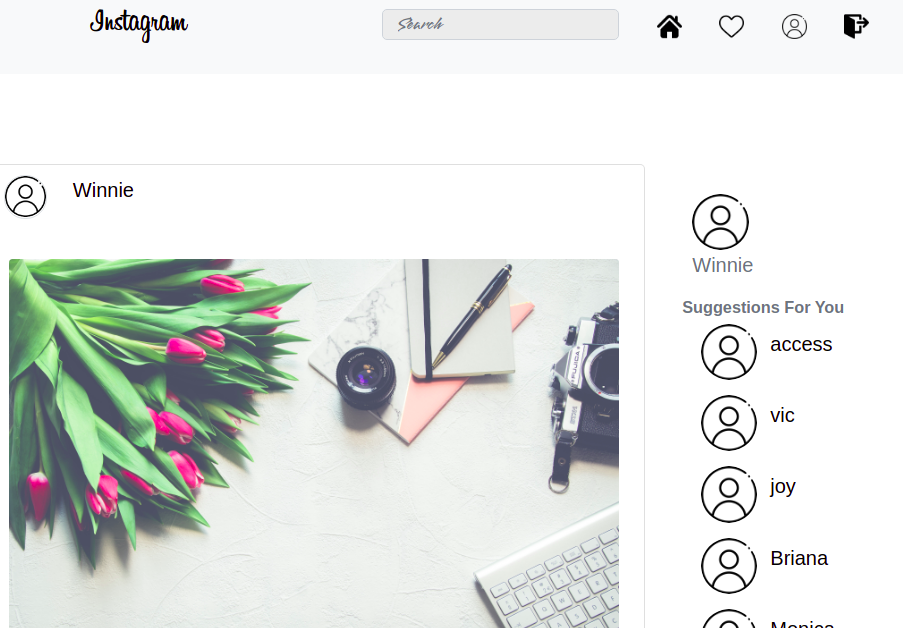

# Instaclone

#### Created By Diana Ondieki Mongina 

## Description

Instaclone is an Instagram web application to showcase pictures and designs. users can create accounts and can be allowed to comment on other users' images. Users are also allowed to search images by name. This application allows users to like pictures.

## Setup Requirements


- Django 
- Pip
- Python 3.8
- PostgreSQL

## Setup Installation

- Copy the github repository url
- Clone to your computer
- Open terminal and navigate to the directory of the project you just cloned to     your computer

- Run the following command to start the server using virtual environment

 ## python3.8 -m venv --without-pip dee
```
 To activate the virtual environment

```
## source virtual/bin/activate
```

```
## pip install -r requirements.txt
```

To copy .env.example to .ENV

```
## cp .env.example .env
```

 Edit the .env file and replace the values with your own Cloudinary credentials and database credentials

To run the server

```
## python manage.py runserver

```
Open the browser and navigate to http://127.0.0.1:8000/ to see the application running

```
## Technologies used

The following languages have been used on this project:

- HTML
- CSS
- Bootstrap
- Python
- Django
- PostgreSQL

## Screenshot

  

## Known Bugs

No known bugs at the moment


## Support and contact details
- Email: dianahmongina2@gmail.com

## License

Copyright (c) 2021 diana Ondieki

Permission is hereby granted, free of charge, to any person obtaining a copy
of this software and associated documentation files , to deal
in the Software without restriction, including without limitation the rights
to use, copy, modify, merge, publish, distribute, sublicense, and/or sell
copies of the Software, and to permit persons to whom the Software is
furnished to do so, subject to the following conditions:

The above copyright notice and this permission notice shall be included in all
copies or substantial portions of the Software.

THE SOFTWARE IS PROVIDED "AS IS", WITHOUT WARRANTY OF ANY KIND, EXPRESS OR
IMPLIED, INCLUDING BUT NOT LIMITED TO THE WARRANTIES OF MERCHANTABILITY,
FITNESS FOR A PARTICULAR PURPOSE AND NONINFRINGEMENT. IN NO EVENT SHALL THE
AUTHORS OR COPYRIGHT HOLDERS BE LIABLE FOR ANY CLAIM, DAMAGES OR OTHER
LIABILITY, WHETHER IN AN ACTION OF CONTRACT, TORT OR OTHERWISE, ARISING FROM,
OUT OF OR IN CONNECTION WITH THE SOFTWARE OR THE USE OR OTHER DEALINGS IN THE
SOFTWARE.
  

